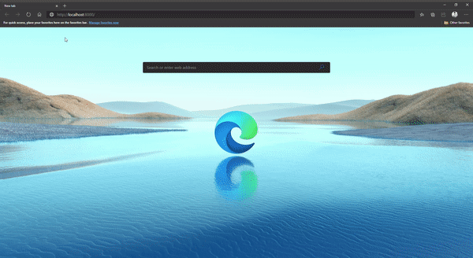

# Django_React
This app is written in Django web frameworks as backend and React frontend. 

# Functionality
1. Record audio from web browser
2. Live waveform of the audio being recorded
3. The recorded file is send to the Django server which stores it in media folder.
4. reverse.py reverses the audio file and store it in media.
5. The recorded audio can be heard in the web.

